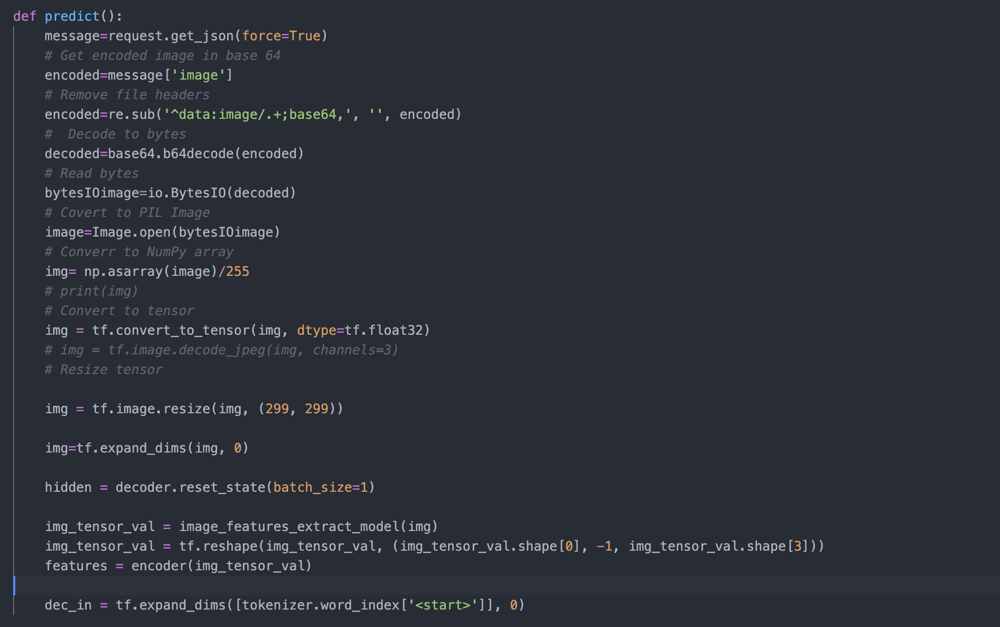
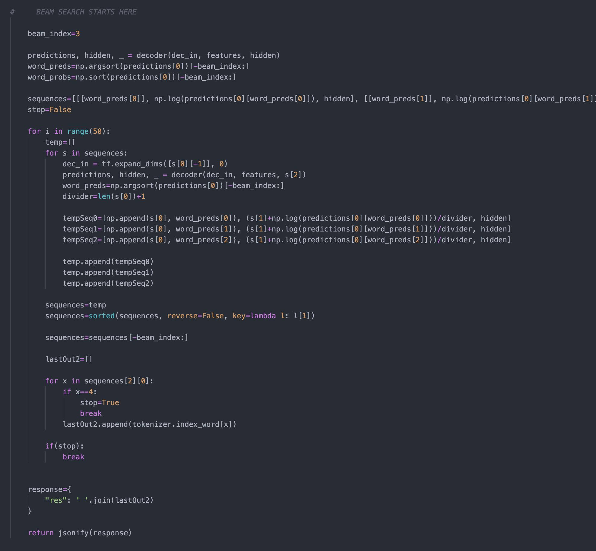
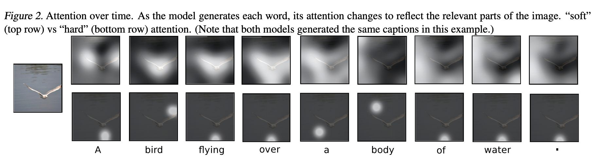

# Connoisseur

This project was the culmination of my work with Convolutional Neural Networks and Sequence Models, allowing me to apply a lot of the technologies I had learned through the <a href="https://www.coursera.org/specializations/deep-learning">"Deep Learning Specialization"</a> on Coursera, taught by Andrew Ng.

The application is able automatically describe the content of images. To do this, it had to be capable of prerceiving contextual subtleties in images, and to relate observations to both the scene and the real world.

## Data Overview

The MS-COCO dataset contained ~400,000 captions and ~80,000 images, i.e each image has 5 corresponding captions. 

**Data Preprocessing:**
 
The images (*.jpeg or *.png) were passed through a Fine Tuned InceptionV3 (pretrained on imagenet) model and converted to an 8 by 8 by 2048 numpy matrices 

The text was tokenized using the Keras.preprocessing.text.Tokenizer

## Model

The model architecture was inspired by the <a herf="Show, Attend and Tell">Show, Attend and Tell</a> paper by Xu et al. (2015)

* The embedded image vector is passed through a CNN encoder
* The RNN decoder then takes the image as input and uses Bahdanau's Attention Model to generate a context that is continuously fed (along with an embedded input word) into a GRU to create a sequence of words that would describe the image.

## Prediction

    The base 64 image is first converted to a tensor and passed through the image_features_extract_model() function, i.e, the InceptionV3 model.

    The caption is then sequentially generated using Beam Search (An optimization of best-first search) of width three. This significantly improves the accuracy of the output caption.

    The following image provides a visual representation of how the model works.

## Future Work/ Improvements:

* Add section for users to submit actual captions (vs generated ones) and add code for an online iterative learning pipeline.